Google Data Analytics Capstone
================
Aidan Whyte
2026-03-19

## Ask

For this project, I work for a company called Cyclistic, which has
stations of rentable bikes for the public all over Chicago, Illinois.
People can either rent bikes for a single use, or for the day, or they
can pay an annual subscription fee to rent bikes whenever and wherever
they need to. These two groups are known as Casuals and Members. The
owner of the company wants to find a way to convert more casual riders
to annual members, as members are far more profitable.

The business task I was assigned was to find out how annual members and
casual riders use Cyclistic bikes differently. What are the noteworthy
differences in behavior between these two groups of users?

## Prepare

The data sources I used are named Divvy 2019 Q1 and Divvy 2020 Q1,
respectively. The datasets have these names because the the project I
was tasked with answering is fictional. The two datasets provided were
appropriate for this project and enabled me to complete my business
task. The data from these two sources have been made public and
available by Motivate International Inc. with [This License
Agreement](https://divvybikes.com/data-license-agreement)

The data is organized so every row in these spreadsheets being a single
ride, characterized by Ride ID, start and end dates and times, Bike Id,
start and end station names and IDs, wheather the user was classified as
member or casual, and other less useful descriptive aspects of each ride
that needn’t be analyzed and were promptly cleaned out.

## Process

After appropriately housing and naming these datasets on my computer, I
checked the data for errors in Google sheets, by trimming all columns,
eliminating blank rows, checked for consistent spelling, and looked for
any duplicate rows of data.

Next, I created a column in each dataset named “ride_length”, which
calculated the total duration of each documented ride in seconds, as
well as a column named “day_of_week”, which output a number that
corresponded to the day of the week, 1 being Sunday and 7 being
Saturday. I now had the calendar date of each day that a ride started
and ended, and the day of the week that ride took place. I then used
pivot tables to look for any outliers and inconsistencies in the
numbers.

Once I was satisfied with how clean the data was, I imported both
datasets into Rstudio for further processing and manipulation.

``` r
q1_2019 <- read_csv("Divvy_Trips_2019_Q1.csv")
```

    ## Rows: 365069 Columns: 14
    ## ── Column specification ────────────────────────────────────────────────────────
    ## Delimiter: ","
    ## chr (7): start_time, end_time, from_station_name, to_station_name, usertype,...
    ## dbl (6): trip_id, bikeid, from_station_id, to_station_id, birthyear, day_of_...
    ## num (1): tripduration
    ## 
    ## ℹ Use `spec()` to retrieve the full column specification for this data.
    ## ℹ Specify the column types or set `show_col_types = FALSE` to quiet this message.

``` r
q1_2020 <- read_csv("Divvy_Trips_2020_Q1.csv")
```

    ## Warning: One or more parsing issues, call `problems()` on your data frame for details,
    ## e.g.:
    ##   dat <- vroom(...)
    ##   problems(dat)

    ## Rows: 426887 Columns: 15
    ## ── Column specification ────────────────────────────────────────────────────────
    ## Delimiter: ","
    ## chr  (7): ride_id, rideable_type, started_at, ended_at, start_station_name, ...
    ## dbl  (7): start_station_id, end_station_id, start_lat, start_lng, end_lat, e...
    ## time (1): ride_length
    ## 
    ## ℹ Use `spec()` to retrieve the full column specification for this data.
    ## ℹ Specify the column types or set `show_col_types = FALSE` to quiet this message.

``` r
colnames(q1_2019)
```

    ##  [1] "trip_id"           "start_time"        "end_time"         
    ##  [4] "bikeid"            "tripduration"      "from_station_id"  
    ##  [7] "from_station_name" "to_station_id"     "to_station_name"  
    ## [10] "usertype"          "gender"            "birthyear"        
    ## [13] "ride_length"       "day_of_week"

``` r
colnames(q1_2020)
```

    ##  [1] "ride_id"            "rideable_type"      "started_at"        
    ##  [4] "ended_at"           "start_station_name" "start_station_id"  
    ##  [7] "end_station_name"   "end_station_id"     "start_lat"         
    ## [10] "start_lng"          "end_lat"            "end_lng"           
    ## [13] "member_casual"      "ride_length"        "day_of_week"

``` r
str(q1_2019)
```

    ## spc_tbl_ [365,069 × 14] (S3: spec_tbl_df/tbl_df/tbl/data.frame)
    ##  $ trip_id          : num [1:365069] 21742443 21742444 21742445 21742446 21742447 ...
    ##  $ start_time       : chr [1:365069] "2019-01-01 0:04:37" "2019-01-01 0:08:13" "2019-01-01 0:13:23" "2019-01-01 0:13:45" ...
    ##  $ end_time         : chr [1:365069] "2019-01-01 0:11:07" "2019-01-01 0:15:34" "2019-01-01 0:27:12" "2019-01-01 0:43:28" ...
    ##  $ bikeid           : num [1:365069] 2167 4386 1524 252 1170 ...
    ##  $ tripduration     : num [1:365069] 390 441 829 1783 364 ...
    ##  $ from_station_id  : num [1:365069] 199 44 15 123 173 98 98 211 150 268 ...
    ##  $ from_station_name: chr [1:365069] "Wabash Ave & Grand Ave" "State St & Randolph St" "Racine Ave & 18th St" "California Ave & Milwaukee Ave" ...
    ##  $ to_station_id    : num [1:365069] 84 624 644 176 35 49 49 142 148 141 ...
    ##  $ to_station_name  : chr [1:365069] "Milwaukee Ave & Grand Ave" "Dearborn St & Van Buren St (*)" "Western Ave & Fillmore St (*)" "Clark St & Elm St" ...
    ##  $ usertype         : chr [1:365069] "Subscriber" "Subscriber" "Subscriber" "Subscriber" ...
    ##  $ gender           : chr [1:365069] "Male" "Female" "Female" "Male" ...
    ##  $ birthyear        : num [1:365069] 1989 1990 1994 1993 1994 ...
    ##  $ ride_length      : chr [1:365069] "0:06:30" "0:07:21" "0:13:49" "0:29:43" ...
    ##  $ day_of_week      : num [1:365069] 3 3 3 3 3 3 3 3 3 3 ...
    ##  - attr(*, "spec")=
    ##   .. cols(
    ##   ..   trip_id = col_double(),
    ##   ..   start_time = col_character(),
    ##   ..   end_time = col_character(),
    ##   ..   bikeid = col_double(),
    ##   ..   tripduration = col_number(),
    ##   ..   from_station_id = col_double(),
    ##   ..   from_station_name = col_character(),
    ##   ..   to_station_id = col_double(),
    ##   ..   to_station_name = col_character(),
    ##   ..   usertype = col_character(),
    ##   ..   gender = col_character(),
    ##   ..   birthyear = col_double(),
    ##   ..   ride_length = col_character(),
    ##   ..   day_of_week = col_double()
    ##   .. )
    ##  - attr(*, "problems")=<externalptr>

``` r
str(q1_2020)
```

    ## spc_tbl_ [426,887 × 15] (S3: spec_tbl_df/tbl_df/tbl/data.frame)
    ##  $ ride_id           : chr [1:426887] "EACB19130B0CDA4A" "8FED874C809DC021" "789F3C21E472CA96" "C9A388DAC6ABF313" ...
    ##  $ rideable_type     : chr [1:426887] "docked_bike" "docked_bike" "docked_bike" "docked_bike" ...
    ##  $ started_at        : chr [1:426887] "2020-01-21 20:06:59" "2020-01-30 14:22:39" "2020-01-09 19:29:26" "2020-01-06 16:17:07" ...
    ##  $ ended_at          : chr [1:426887] "2020-01-21 20:14:30" "2020-01-30 14:26:22" "2020-01-09 19:32:17" "2020-01-06 16:25:56" ...
    ##  $ start_station_name: chr [1:426887] "Western Ave & Leland Ave" "Clark St & Montrose Ave" "Broadway & Belmont Ave" "Clark St & Randolph St" ...
    ##  $ start_station_id  : num [1:426887] 239 234 296 51 66 212 96 96 212 38 ...
    ##  $ end_station_name  : chr [1:426887] "Clark St & Leland Ave" "Southport Ave & Irving Park Rd" "Wilton Ave & Belmont Ave" "Fairbanks Ct & Grand Ave" ...
    ##  $ end_station_id    : num [1:426887] 326 318 117 24 212 96 212 212 96 100 ...
    ##  $ start_lat         : num [1:426887] 42 42 41.9 41.9 41.9 ...
    ##  $ start_lng         : num [1:426887] -87.7 -87.7 -87.6 -87.6 -87.6 ...
    ##  $ end_lat           : num [1:426887] 42 42 41.9 41.9 41.9 ...
    ##  $ end_lng           : num [1:426887] -87.7 -87.7 -87.7 -87.6 -87.6 ...
    ##  $ member_casual     : chr [1:426887] "member" "member" "member" "member" ...
    ##  $ ride_length       : 'hms' num [1:426887] 00:07:31 00:03:43 00:02:51 00:08:49 ...
    ##   ..- attr(*, "units")= chr "secs"
    ##  $ day_of_week       : num [1:426887] 3 5 5 2 5 6 6 6 6 6 ...
    ##  - attr(*, "spec")=
    ##   .. cols(
    ##   ..   ride_id = col_character(),
    ##   ..   rideable_type = col_character(),
    ##   ..   started_at = col_character(),
    ##   ..   ended_at = col_character(),
    ##   ..   start_station_name = col_character(),
    ##   ..   start_station_id = col_double(),
    ##   ..   end_station_name = col_character(),
    ##   ..   end_station_id = col_double(),
    ##   ..   start_lat = col_double(),
    ##   ..   start_lng = col_double(),
    ##   ..   end_lat = col_double(),
    ##   ..   end_lng = col_double(),
    ##   ..   member_casual = col_character(),
    ##   ..   ride_length = col_time(format = ""),
    ##   ..   day_of_week = col_double()
    ##   .. )
    ##  - attr(*, "problems")=<externalptr>

``` r
head(q1_2019)
```

    ## # A tibble: 6 × 14
    ##    trip_id start_time         end_time       bikeid tripduration from_station_id
    ##      <dbl> <chr>              <chr>           <dbl>        <dbl>           <dbl>
    ## 1 21742443 2019-01-01 0:04:37 2019-01-01 0:…   2167          390             199
    ## 2 21742444 2019-01-01 0:08:13 2019-01-01 0:…   4386          441              44
    ## 3 21742445 2019-01-01 0:13:23 2019-01-01 0:…   1524          829              15
    ## 4 21742446 2019-01-01 0:13:45 2019-01-01 0:…    252         1783             123
    ## 5 21742447 2019-01-01 0:14:52 2019-01-01 0:…   1170          364             173
    ## 6 21742448 2019-01-01 0:15:33 2019-01-01 0:…   2437          216              98
    ## # ℹ 8 more variables: from_station_name <chr>, to_station_id <dbl>,
    ## #   to_station_name <chr>, usertype <chr>, gender <chr>, birthyear <dbl>,
    ## #   ride_length <chr>, day_of_week <dbl>

``` r
head(q1_2020)
```

    ## # A tibble: 6 × 15
    ##   ride_id  rideable_type started_at ended_at start_station_name start_station_id
    ##   <chr>    <chr>         <chr>      <chr>    <chr>                         <dbl>
    ## 1 EACB191… docked_bike   2020-01-2… 2020-01… Western Ave & Lel…              239
    ## 2 8FED874… docked_bike   2020-01-3… 2020-01… Clark St & Montro…              234
    ## 3 789F3C2… docked_bike   2020-01-0… 2020-01… Broadway & Belmon…              296
    ## 4 C9A388D… docked_bike   2020-01-0… 2020-01… Clark St & Randol…               51
    ## 5 943BC3C… docked_bike   2020-01-3… 2020-01… Clinton St & Lake…               66
    ## 6 6D9C8A6… docked_bike   2020-01-1… 2020-01… Wells St & Hubbar…              212
    ## # ℹ 9 more variables: end_station_name <chr>, end_station_id <dbl>,
    ## #   start_lat <dbl>, start_lng <dbl>, end_lat <dbl>, end_lng <dbl>,
    ## #   member_casual <chr>, ride_length <time>, day_of_week <dbl>

``` r
glimpse(q1_2019)
```

    ## Rows: 365,069
    ## Columns: 14
    ## $ trip_id           <dbl> 21742443, 21742444, 21742445, 21742446, 21742447, 21…
    ## $ start_time        <chr> "2019-01-01 0:04:37", "2019-01-01 0:08:13", "2019-01…
    ## $ end_time          <chr> "2019-01-01 0:11:07", "2019-01-01 0:15:34", "2019-01…
    ## $ bikeid            <dbl> 2167, 4386, 1524, 252, 1170, 2437, 2708, 2796, 6205,…
    ## $ tripduration      <dbl> 390, 441, 829, 1783, 364, 216, 177, 100, 1727, 336, …
    ## $ from_station_id   <dbl> 199, 44, 15, 123, 173, 98, 98, 211, 150, 268, 299, 2…
    ## $ from_station_name <chr> "Wabash Ave & Grand Ave", "State St & Randolph St", …
    ## $ to_station_id     <dbl> 84, 624, 644, 176, 35, 49, 49, 142, 148, 141, 295, 4…
    ## $ to_station_name   <chr> "Milwaukee Ave & Grand Ave", "Dearborn St & Van Bure…
    ## $ usertype          <chr> "Subscriber", "Subscriber", "Subscriber", "Subscribe…
    ## $ gender            <chr> "Male", "Female", "Female", "Male", "Male", "Female"…
    ## $ birthyear         <dbl> 1989, 1990, 1994, 1993, 1994, 1983, 1984, 1990, 1995…
    ## $ ride_length       <chr> "0:06:30", "0:07:21", "0:13:49", "0:29:43", "0:06:04…
    ## $ day_of_week       <dbl> 3, 3, 3, 3, 3, 3, 3, 3, 3, 3, 3, 3, 3, 3, 3, 3, 3, 3…

``` r
glimpse(q1_2020)
```

    ## Rows: 426,887
    ## Columns: 15
    ## $ ride_id            <chr> "EACB19130B0CDA4A", "8FED874C809DC021", "789F3C21E4…
    ## $ rideable_type      <chr> "docked_bike", "docked_bike", "docked_bike", "docke…
    ## $ started_at         <chr> "2020-01-21 20:06:59", "2020-01-30 14:22:39", "2020…
    ## $ ended_at           <chr> "2020-01-21 20:14:30", "2020-01-30 14:26:22", "2020…
    ## $ start_station_name <chr> "Western Ave & Leland Ave", "Clark St & Montrose Av…
    ## $ start_station_id   <dbl> 239, 234, 296, 51, 66, 212, 96, 96, 212, 38, 117, 1…
    ## $ end_station_name   <chr> "Clark St & Leland Ave", "Southport Ave & Irving Pa…
    ## $ end_station_id     <dbl> 326, 318, 117, 24, 212, 96, 212, 212, 96, 100, 632,…
    ## $ start_lat          <dbl> 41.9665, 41.9616, 41.9401, 41.8846, 41.8856, 41.889…
    ## $ start_lng          <dbl> -87.6884, -87.6660, -87.6455, -87.6319, -87.6418, -…
    ## $ end_lat            <dbl> 41.9671, 41.9542, 41.9402, 41.8918, 41.8899, 41.884…
    ## $ end_lng            <dbl> -87.6674, -87.6644, -87.6530, -87.6206, -87.6343, -…
    ## $ member_casual      <chr> "member", "member", "member", "member", "member", "…
    ## $ ride_length        <time> 00:07:31, 00:03:43, 00:02:51, 00:08:49, 00:05:32, …
    ## $ day_of_week        <dbl> 3, 5, 5, 2, 5, 6, 6, 6, 6, 6, 3, 4, 4, 5, 3, 3, 3, …

After reviewing the imported data, I renamed all possible columns to
match with the most current quarter (2020). I then mutated or deleted
incongruent datatypes and columns so both datasets could be bound
together into a single new dataset.

``` r
q1_2019 <- rename(q1_2019, 
                  ride_id = trip_id,
                  rideable_type = bikeid,
                  started_at = start_time,
                  ended_at = end_time,
                  start_station_name = from_station_name,
                  start_station_id = from_station_id,
                  end_station_name = to_station_name,
                  end_station_id = to_station_id,
                  member_casual = usertype)


colnames(q1_2019)
```

    ##  [1] "ride_id"            "started_at"         "ended_at"          
    ##  [4] "rideable_type"      "tripduration"       "start_station_id"  
    ##  [7] "start_station_name" "end_station_id"     "end_station_name"  
    ## [10] "member_casual"      "gender"             "birthyear"         
    ## [13] "ride_length"        "day_of_week"

``` r
colnames(q1_2020)
```

    ##  [1] "ride_id"            "rideable_type"      "started_at"        
    ##  [4] "ended_at"           "start_station_name" "start_station_id"  
    ##  [7] "end_station_name"   "end_station_id"     "start_lat"         
    ## [10] "start_lng"          "end_lat"            "end_lng"           
    ## [13] "member_casual"      "ride_length"        "day_of_week"

``` r
q1_2019 <- q1_2019 %>%
  mutate(ride_id = as.character(ride_id),
         rideable_type = as.character(rideable_type),
         started_at = ymd_hms(started_at),
         ended_at = ymd_hms(ended_at),
         ride_length = as.numeric(difftime(ended_at, started_at, units = 'secs')))

q1_2020 <- q1_2020 %>%
  mutate(started_at = ymd_hms(started_at),
         ended_at = ymd_hms(ended_at),
         ride_length = as.numeric(difftime(ended_at, started_at, units = 'secs')))


all_trips <- bind_rows(q1_2019, q1_2020)


all_trips <- all_trips %>%
  select(-c(start_lat, start_lng, end_lat, end_lng, birthyear, gender, tripduration))


colnames(all_trips)
```

    ##  [1] "ride_id"            "started_at"         "ended_at"          
    ##  [4] "rideable_type"      "start_station_id"   "start_station_name"
    ##  [7] "end_station_id"     "end_station_name"   "member_casual"     
    ## [10] "ride_length"        "day_of_week"

``` r
head(all_trips)
```

    ## # A tibble: 6 × 11
    ##   ride_id started_at          ended_at            rideable_type start_station_id
    ##   <chr>   <dttm>              <dttm>              <chr>                    <dbl>
    ## 1 217424… 2019-01-01 00:04:37 2019-01-01 00:11:07 2167                       199
    ## 2 217424… 2019-01-01 00:08:13 2019-01-01 00:15:34 4386                        44
    ## 3 217424… 2019-01-01 00:13:23 2019-01-01 00:27:12 1524                        15
    ## 4 217424… 2019-01-01 00:13:45 2019-01-01 00:43:28 252                        123
    ## 5 217424… 2019-01-01 00:14:52 2019-01-01 00:20:56 1170                       173
    ## 6 217424… 2019-01-01 00:15:33 2019-01-01 00:19:09 2437                        98
    ## # ℹ 6 more variables: start_station_name <chr>, end_station_id <dbl>,
    ## #   end_station_name <chr>, member_casual <chr>, ride_length <dbl>,
    ## #   day_of_week <dbl>

``` r
str(all_trips)
```

    ## tibble [791,956 × 11] (S3: tbl_df/tbl/data.frame)
    ##  $ ride_id           : chr [1:791956] "21742443" "21742444" "21742445" "21742446" ...
    ##  $ started_at        : POSIXct[1:791956], format: "2019-01-01 00:04:37" "2019-01-01 00:08:13" ...
    ##  $ ended_at          : POSIXct[1:791956], format: "2019-01-01 00:11:07" "2019-01-01 00:15:34" ...
    ##  $ rideable_type     : chr [1:791956] "2167" "4386" "1524" "252" ...
    ##  $ start_station_id  : num [1:791956] 199 44 15 123 173 98 98 211 150 268 ...
    ##  $ start_station_name: chr [1:791956] "Wabash Ave & Grand Ave" "State St & Randolph St" "Racine Ave & 18th St" "California Ave & Milwaukee Ave" ...
    ##  $ end_station_id    : num [1:791956] 84 624 644 176 35 49 49 142 148 141 ...
    ##  $ end_station_name  : chr [1:791956] "Milwaukee Ave & Grand Ave" "Dearborn St & Van Buren St (*)" "Western Ave & Fillmore St (*)" "Clark St & Elm St" ...
    ##  $ member_casual     : chr [1:791956] "Subscriber" "Subscriber" "Subscriber" "Subscriber" ...
    ##  $ ride_length       : num [1:791956] 390 441 829 1783 364 ...
    ##  $ day_of_week       : num [1:791956] 3 3 3 3 3 3 3 3 3 3 ...

``` r
glimpse(all_trips)
```

    ## Rows: 791,956
    ## Columns: 11
    ## $ ride_id            <chr> "21742443", "21742444", "21742445", "21742446", "21…
    ## $ started_at         <dttm> 2019-01-01 00:04:37, 2019-01-01 00:08:13, 2019-01-…
    ## $ ended_at           <dttm> 2019-01-01 00:11:07, 2019-01-01 00:15:34, 2019-01-…
    ## $ rideable_type      <chr> "2167", "4386", "1524", "252", "1170", "2437", "270…
    ## $ start_station_id   <dbl> 199, 44, 15, 123, 173, 98, 98, 211, 150, 268, 299, …
    ## $ start_station_name <chr> "Wabash Ave & Grand Ave", "State St & Randolph St",…
    ## $ end_station_id     <dbl> 84, 624, 644, 176, 35, 49, 49, 142, 148, 141, 295, …
    ## $ end_station_name   <chr> "Milwaukee Ave & Grand Ave", "Dearborn St & Van Bur…
    ## $ member_casual      <chr> "Subscriber", "Subscriber", "Subscriber", "Subscrib…
    ## $ ride_length        <dbl> 390, 441, 829, 1783, 364, 216, 177, 100, 1727, 336,…
    ## $ day_of_week        <dbl> 3, 3, 3, 3, 3, 3, 3, 3, 3, 3, 3, 3, 3, 3, 3, 3, 3, …

``` r
summary(all_trips)
```

    ##    ride_id            started_at                    
    ##  Length:791956      Min.   :2019-01-01 00:04:37.00  
    ##  Class :character   1st Qu.:2019-02-28 17:04:04.75  
    ##  Mode  :character   Median :2020-01-07 12:48:50.50  
    ##                     Mean   :2019-09-01 11:58:08.35  
    ##                     3rd Qu.:2020-02-19 19:31:54.75  
    ##                     Max.   :2020-03-31 23:51:34.00  
    ##                                                     
    ##     ended_at                      rideable_type      start_station_id
    ##  Min.   :2019-01-01 00:11:07.00   Length:791956      Min.   :  2.0   
    ##  1st Qu.:2019-02-28 17:15:58.75   Class :character   1st Qu.: 77.0   
    ##  Median :2020-01-07 13:02:50.00   Mode  :character   Median :174.0   
    ##  Mean   :2019-09-01 12:17:52.17                      Mean   :204.4   
    ##  3rd Qu.:2020-02-19 19:51:54.50                      3rd Qu.:291.0   
    ##  Max.   :2020-05-19 20:10:34.00                      Max.   :675.0   
    ##                                                                      
    ##  start_station_name end_station_id  end_station_name   member_casual     
    ##  Length:791956      Min.   :  2.0   Length:791956      Length:791956     
    ##  Class :character   1st Qu.: 77.0   Class :character   Class :character  
    ##  Mode  :character   Median :174.0   Mode  :character   Mode  :character  
    ##                     Mean   :204.4                                        
    ##                     3rd Qu.:291.0                                        
    ##                     Max.   :675.0                                        
    ##                     NA's   :1                                            
    ##   ride_length        day_of_week  
    ##  Min.   :    -552   Min.   :1.00  
    ##  1st Qu.:     328   1st Qu.:3.00  
    ##  Median :     537   Median :4.00  
    ##  Mean   :    1184   Mean   :3.99  
    ##  3rd Qu.:     910   3rd Qu.:5.00  
    ##  Max.   :10632022   Max.   :7.00  
    ## 

After reviewing this new dataset, I reassigned the labels of members and
casuals for consolidation, because sometimes they were labeled as
“subscriber” or “customer”.

``` r
table(all_trips$member_casual)
```

    ## 
    ##     casual   Customer     member Subscriber 
    ##      48480      23163     378407     341906

``` r
all_trips <- all_trips %>%
  mutate(member_casual = recode(member_casual,
                                "Subscriber" = "member",
                                "Customer" = "casual"))

table(all_trips$member_casual)
```

    ## 
    ## casual member 
    ##  71643 720313

Next, I added day, month, year, and time of day columns for more ways to
aggregate and anaylze data, and removed entries where bikes were taken
out for quality inspections, and where ride_length data (in seconds) was
negative.

``` r
all_trips$date <- as.Date(all_trips$started_at)

all_trips <- all_trips %>%
  mutate(month = format(as.Date(all_trips$date), "%m"),
         day = format(as.Date(all_trips$date), "%d"),
         year = format(as.Date(all_trips$date), "%Y"),
         day_of_week = format(as.Date(all_trips$date), "%A"),
         time_of_day = format(as.POSIXct(all_trips$started_at), "%H"))


all_trips <- all_trips %>%
  mutate(ride_length = as.numeric(difftime(ended_at, started_at, units = 'secs')))


all_trips_v2 <- all_trips[!(all_trips$start_station_name == "HQ QR" | 
                              all_trips$end_station_name == "HQ QR" | all_trips$ride_length<0),]
```

## ANALYZE

I performed various descriptive analysis and aggregate fuctions for the
ride length of each ride and compared them between members and casuals.

``` r
summary(all_trips_v2)
```

    ##    ride_id            started_at                    
    ##  Length:788188      Min.   :2019-01-01 00:04:37.00  
    ##  Class :character   1st Qu.:2019-02-28 13:39:55.50  
    ##  Mode  :character   Median :2020-01-07 07:59:49.00  
    ##                     Mean   :2019-08-31 14:14:22.20  
    ##                     3rd Qu.:2020-02-19 12:38:45.25  
    ##                     Max.   :2020-03-31 23:51:34.00  
    ##     ended_at                      rideable_type      start_station_id
    ##  Min.   :2019-01-01 00:11:07.00   Length:788188      Min.   :  2.0   
    ##  1st Qu.:2019-02-28 13:51:43.00   Class :character   1st Qu.: 77.0   
    ##  Median :2020-01-07 08:10:57.00   Mode  :character   Median :174.0   
    ##  Mean   :2019-08-31 14:34:11.36                      Mean   :202.2   
    ##  3rd Qu.:2020-02-19 12:57:02.25                      3rd Qu.:289.0   
    ##  Max.   :2020-05-19 20:10:34.00                      Max.   :673.0   
    ##  start_station_name end_station_id  end_station_name   member_casual     
    ##  Length:788188      Min.   :  2.0   Length:788188      Length:788188     
    ##  Class :character   1st Qu.: 77.0   Class :character   Class :character  
    ##  Mode  :character   Median :173.0   Mode  :character   Mode  :character  
    ##                     Mean   :202.1                                        
    ##                     3rd Qu.:289.0                                        
    ##                     Max.   :673.0                                        
    ##   ride_length       day_of_week             date               month          
    ##  Min.   :       1   Length:788188      Min.   :2019-01-01   Length:788188     
    ##  1st Qu.:     331   Class :character   1st Qu.:2019-02-28   Class :character  
    ##  Median :     539   Mode  :character   Median :2020-01-07   Mode  :character  
    ##  Mean   :    1189                      Mean   :2019-08-31                     
    ##  3rd Qu.:     912                      3rd Qu.:2020-02-19                     
    ##  Max.   :10632022                      Max.   :2020-03-31                     
    ##      day                year           time_of_day       
    ##  Length:788188      Length:788188      Length:788188     
    ##  Class :character   Class :character   Class :character  
    ##  Mode  :character   Mode  :character   Mode  :character  
    ##                                                          
    ##                                                          
    ## 

``` r
mean(all_trips_v2$ride_length) 
```

    ## [1] 1189.175

``` r
median(all_trips_v2$ride_length) 
```

    ## [1] 539

``` r
max(all_trips_v2$ride_length)
```

    ## [1] 10632022

``` r
min(all_trips_v2$ride_length)
```

    ## [1] 1

``` r
aggregate(all_trips_v2$ride_length ~ all_trips_v2$member_casual, FUN = mean)
```

    ##   all_trips_v2$member_casual all_trips_v2$ride_length
    ## 1                     casual                5372.7839
    ## 2                     member                 794.9416

``` r
aggregate(all_trips_v2$ride_length ~ all_trips_v2$member_casual, FUN = median)
```

    ##   all_trips_v2$member_casual all_trips_v2$ride_length
    ## 1                     casual                     1393
    ## 2                     member                      508

``` r
aggregate(all_trips_v2$ride_length ~ all_trips_v2$member_casual, FUN = max)
```

    ##   all_trips_v2$member_casual all_trips_v2$ride_length
    ## 1                     casual                 10632022
    ## 2                     member                  6096428

``` r
aggregate(all_trips_v2$ride_length ~ all_trips_v2$member_casual, FUN = min)
```

    ##   all_trips_v2$member_casual all_trips_v2$ride_length
    ## 1                     casual                        2
    ## 2                     member                        1

I also found the total number and average duration of rides by both
members and casuals for each day of the week

``` r
all_trips_v2$day_of_week <- ordered(all_trips_v2$day_of_week, 
                                    levels=c("Sunday", 
                                             "Monday",
                                             "Tuesday", 
                                             "Wednesday", 
                                             "Thursday", 
                                             "Friday", 
                                             "Saturday"))


aggregate(all_trips_v2$ride_length ~ all_trips_v2$member_casual + 
            all_trips_v2$day_of_week, FUN = mean)
```

    ##    all_trips_v2$member_casual all_trips_v2$day_of_week all_trips_v2$ride_length
    ## 1                      casual                   Sunday                5061.3044
    ## 2                      member                   Sunday                 969.2231
    ## 3                      casual                   Monday                4752.0504
    ## 4                      member                   Monday                 822.3112
    ## 5                      casual                  Tuesday                4561.8039
    ## 6                      member                  Tuesday                 769.4416
    ## 7                      casual                Wednesday                4480.3724
    ## 8                      member                Wednesday                 711.9838
    ## 9                      casual                 Thursday                8451.6669
    ## 10                     member                 Thursday                 707.2093
    ## 11                     casual                   Friday                6090.7373
    ## 12                     member                   Friday                 796.7338
    ## 13                     casual                 Saturday                4950.7708
    ## 14                     member                 Saturday                 974.0730

``` r
all_trips_v2 %>%
  group_by(member_casual, day_of_week) %>%
  summarise(number_of_rides = n(),
            average_duration = mean(ride_length))
```

    ## `summarise()` has grouped output by 'member_casual'. You can override using the
    ## `.groups` argument.

    ## # A tibble: 14 × 4
    ## # Groups:   member_casual [2]
    ##    member_casual day_of_week number_of_rides average_duration
    ##    <chr>         <ord>                 <int>            <dbl>
    ##  1 casual        Sunday                18652            5061.
    ##  2 casual        Monday                 5591            4752.
    ##  3 casual        Tuesday                7311            4562.
    ##  4 casual        Wednesday              7690            4480.
    ##  5 casual        Thursday               7147            8452.
    ##  6 casual        Friday                 8013            6091.
    ##  7 casual        Saturday              13473            4951.
    ##  8 member        Sunday                60196             969.
    ##  9 member        Monday               110430             822.
    ## 10 member        Tuesday              127974             769.
    ## 11 member        Wednesday            121902             712.
    ## 12 member        Thursday             125228             707.
    ## 13 member        Friday               115168             797.
    ## 14 member        Saturday              59413             974.

Then I compared the number of total rides for every hour of the day,
every day of the week, and every day of the month between members and
casuals, as well as the average duration of each of these rides by the
same criteria.

``` r
all_trips_v2 %>%
  group_by(member_casual, time_of_day) %>%
  summarise(Total_Rides = n()) %>%
  ##slice_max(totals, n = 10) %>%
  ggplot(aes(x = time_of_day, y = Total_Rides, fill = member_casual)) +
  theme(axis.text.x = element_text(angle = 45)) +
  geom_col(position = "dodge") +
  labs(title = "Total Number of Rides Throughout Hours of the Day")
```

    ## `summarise()` has grouped output by 'member_casual'. You can override using the
    ## `.groups` argument.

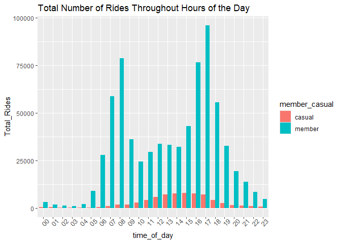<!-- -->

``` r
all_trips_v2 %>%
  group_by(member_casual, time_of_day) %>%
  summarise(Average_Duration = mean(ride_length)) %>%
  ##slice_max(average_duration, n = 10) %>%
  ggplot(aes(x = time_of_day, y = Average_Duration, fill = member_casual)) +
  theme(axis.text.x = element_text(angle = 45)) +
  geom_col(position = "dodge") +
  labs(title = "Average Duration of Rides Throughout Hours of the Day")
```

    ## `summarise()` has grouped output by 'member_casual'. You can override using the
    ## `.groups` argument.

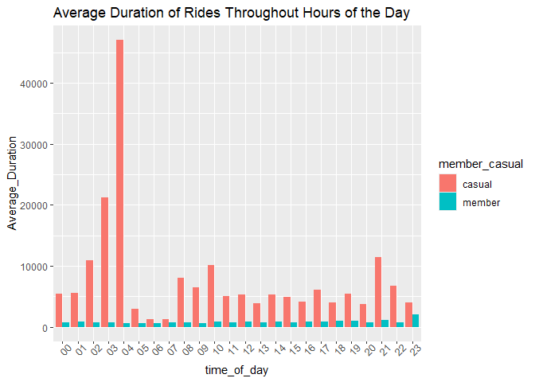<!-- -->

``` r
all_trips_v2 %>%
  group_by(member_casual, day_of_week) %>%
  summarise(Total_Rides = n()) %>%
  ggplot(aes(x = day_of_week, y = Total_Rides, fill = member_casual)) +
  geom_col(position = "dodge") + 
  scale_y_continuous (labels = scales::comma) +
  labs(title = "Total Rides by Rider Type for each Day of Week")
```

    ## `summarise()` has grouped output by 'member_casual'. You can override using the
    ## `.groups` argument.

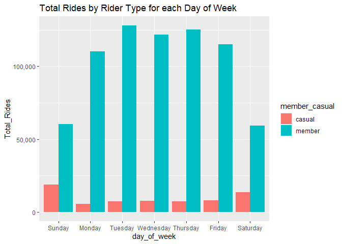<!-- -->

``` r
all_trips_v2 %>%
  group_by(member_casual, day_of_week) %>%
  summarise(Average_Duration = mean(ride_length)) %>%
  ggplot(aes(x = day_of_week, y = Average_Duration, fill = member_casual)) +
  geom_col(position = "dodge") + 
  labs(title = "Average Ride Duration by Rider Type for Each Day of Week")
```

    ## `summarise()` has grouped output by 'member_casual'. You can override using the
    ## `.groups` argument.

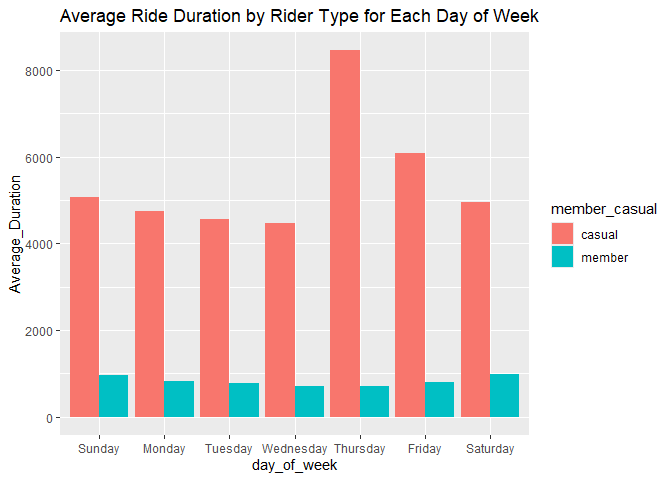<!-- -->

``` r
all_trips_v2 %>%
  group_by(member_casual, day) %>%
  summarise(Total_Rides = n()) %>%
  ggplot(aes(x = day, y = Total_Rides, fill = member_casual)) +
  geom_col() +
  labs(title = "Total Rides by Rider Type for Each Day of Month")
```

    ## `summarise()` has grouped output by 'member_casual'. You can override using the
    ## `.groups` argument.

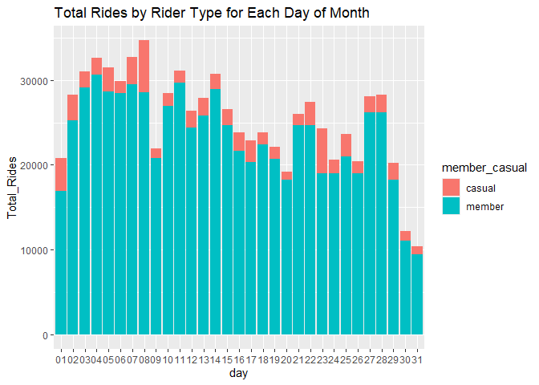<!-- -->

``` r
all_trips_v2 %>%
  group_by(member_casual, day) %>%
  summarise(Average_Duration = mean(ride_length)) %>%
  ggplot(aes(x = day, y = Average_Duration, fill = member_casual)) +
  geom_col() + 
  labs(title = "Average Ride Duration by Rider Type for Each Day of Month")
```

    ## `summarise()` has grouped output by 'member_casual'. You can override using the
    ## `.groups` argument.

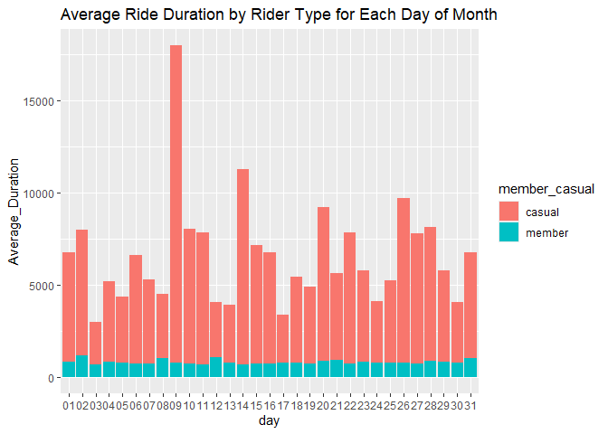<!-- -->

The trends I discovered were that, for the number of rides by rider
type, members use Cyclistic bikes far more often than casuals across the
board. For the times of the day, the days of the week, and the days of
the month, there are hundreds to thousands more rides from members than
casuals.

However, with regards to the average duration of all rides by rider
type, the casual users would spend far more time with Cyclistic bikes
than members across the board. While the vast majorty of members don’t
spend more than 20-30 minutes on their rides, the casual riders use the
bikes they rent for an hour, or multiple, at a time.

Next, I counted and compared the total number of times a station was the
start OR end of a ride by members and casuals to find the most
frequented stations of each group, as well as when each of these rides
started and ended. Once I had a sorted list of the most frequented
stations, I mapped the top 10 most frequented start and end locations
for both members and casuals.

``` r
sort(table(all_trips_v2$start_station_id), decreasing = TRUE)
```

    ## 
    ##   192    91    77   195   133   174    43   287    48    66   283    49    81 
    ## 14155 13640 13362  9080  9021  8208  7525  7227  6708  6674  6426  6332  6251 
    ##    52   110    56    36   199    53   211   212   176   100   638    71    74 
    ##  6113  5618  5521  5495  5322  5222  5182  5127  5059  5048  4945  4891  4876 
    ##    18    59    47    35    44   191   164    51   289    38    24    67   344 
    ##  4839  4634  4632  4533  4521  4492  4460  4435  4393  4223  4145  4139  4094 
    ##   210    69   255   181   107   423    76    90    26   142    50    58    84 
    ##  4090  4042  3993  3954  3931  3892  3811  3796  3751  3746  3677  3638  3566 
    ##    31   198   117   111    98   264   196   286    37   140   182   134   300 
    ##  3549  3507  3486  3485  3484  3472  3445  3411  3395  3376  3358  3342  3336 
    ##    94    39   241   331   240   125   161    13    41   321     3   320    21 
    ##  3305  3300  3224  3191  3159  3145  3127  3074  3021  3008  2899  2880  2877 
    ##   340    85   173   342    75   113   291   420   301    33    96   118   112 
    ##  2814  2813  2809  2804  2751  2736  2722  2719  2716  2691  2676  2666  2607 
    ##    80   177   426   284   127   229   197    89   141   337   145   175   143 
    ##  2596  2585  2577  2559  2524  2520  2499  2461  2447  2441  2429  2421  2419 
    ##   194   304   227   106   322   359    73   144   115   303   364    20   168 
    ##  2407  2396  2378  2371  2347  2324  2321  2306  2264  2249  2235  2221  2215 
    ##   232   156   220   327   621    40   153   627   172   313    61   636   273 
    ##  2189  2178  2157  2154  2131  2115  2113  2112  2103  2101  2085  2081  2080 
    ##    54   108   109   233   299   158   332    68   116    93   254   635   268 
    ##  2075  2058  2046  2043  2027  2026  2019  2004  2003  1985  1983  1980  1956 
    ##   130    60    72    99   128   349   123   225     7   325   414   114   296 
    ##  1909  1896  1896  1883  1870  1840  1809  1803  1795  1778  1776  1773  1773 
    ##   219    87   328   620   346   138    17   260   186   230   334   623   180 
    ##  1765  1750  1745  1742  1720  1718  1690  1681  1678  1663  1661  1661  1657 
    ##   317   341   307   376   624   324    55   157   312   217   256    29   345 
    ##  1649  1641  1638  1637  1624  1609  1599  1594  1593  1591  1588  1582  1570 
    ##   293   152   223   242   129    25    92    45   672    32   165    22   374 
    ##  1569  1551  1550  1535  1515  1511  1510  1487  1485  1468  1459  1452  1443 
    ##   418   119   338    46   231   463     5   302   657   131     6   288   247 
    ##  1441  1419  1409  1407  1406  1394  1392  1385  1369  1362  1352  1347  1342 
    ##   626    86   190   333   329   183   224   188    57   261     4    88   226 
    ##  1334  1327  1327  1327  1326  1293  1276  1255  1254  1247  1242  1240  1237 
    ##    16   239   294   343   282   248   318   417   350    19    97   148   596 
    ##  1233  1225  1222  1214  1199  1186  1183  1151  1140  1139  1139  1136  1136 
    ##   126   394   146    15   383    30   632   654   305    23    14   295   166 
    ##  1135  1125  1123  1117  1102  1099  1089  1078  1068  1062  1057  1049  1045 
    ##   137    28   214   213   237   234   277   637   306   290   461   460   243 
    ##  1040  1038  1037  1017  1006   996   993   981   943   941   933   929   928 
    ##   622   169   154   326   257   159   454   459   425   244   347   205   285 
    ##   925   919   918   916   911   908   899   899   896   894   878   877   864 
    ##   160   432   249   511   604   245   464   506   310   163   298   309   458 
    ##   863   843   824   818   809   808   806   805   801   782   778   777   774 
    ##   419   121   258   507   319   308     2   659   238    27   292   253   251 
    ##   771   764   763   763   757   756   746   746   737   736   731   720   692 
    ##   236   339   250   447   597    62   323   222   451   673   314   493   639 
    ##   681   680   678   669   656   655   654   646   637   633   628   626   621 
    ##   605   170   276   482   120   259   150   465   523    34   272   315   162 
    ##   619   613   594   594   593   580   578   578   578   577   572   566   565 
    ##   207   275    42   520   311   505   457   628   149   297   515   184   658 
    ##   556   548   546   535   534   534   521   521   513   509   508   505   497 
    ##   206   215   246   502   202   491   489   499   478   185   625   178   462 
    ##   493   491   489   488   484   472   468   468   467   462   460   455   454 
    ##   147   274   365   316   370   504   103   330   475   503   660   228   208 
    ##   452   444   444   443   443   442   436   433   433   433   433   426   424 
    ##   501   406   486   490   171   603   218   449   122   216   481   402   641 
    ##   423   414   414   402   401   379   377   376   371   365   365   362   361 
    ##   467   252   424   644   664   601   124   453   280   509   136   483   413 
    ##   360   359   358   348   346   344   343   339   338   328   326   323   322 
    ##   655   472   382   203   204   209   354   366   498   500   471   484   135 
    ##   318   310   302   301   300   294   294   294   294   294   288   287   284 
    ##   474   656   497   631   267   381   405   437   403   476   492   132   442 
    ##   281   272   271   262   261   259   254   251   250   244   242   240   239 
    ##   448   278   510   477   377   525   434   479   598   263   470   602   351 
    ##   235   234   231   229   227   227   226   226   224   222   213   211   208 
    ##   517   508   179   640   663   527   101   666   401   416   487   193   348 
    ##   207   201   198   198   197   191   187   187   184   183   181   177   177 
    ##   452   279   496   552   378   281   336   469   600   335   466   373   643 
    ##   176   175   174   171   168   165   164   163   161   159   157   154   152 
    ##   488   522   592   368   450   514   410   480   645   355   590   271    12 
    ##   150   150   147   143   141   141   140   140   136   131   131   127   123 
    ##     9   385   591   485   619   415   495   262   367   412   661   439   662 
    ##   118   118   117   115   112   111   111   110   108   108   106   105   103 
    ##   589   375   468   518   265   526   353   456   408   427   422   369   356 
    ##   102   101    99    99    96    92    91    87    86    85    84    75    72 
    ##   519   494   411   630   446   532   167   599   201    11   429   428   547 
    ##    70    69    65    63    61    61    59    59    57    56    55    52    52 
    ##   551   573   200   102   421   445   390   409   431   558   594   399   559 
    ##    48    46    44    41    41    41    40    40    40    40    40    37    37 
    ##   270   388   407   444   436   550   535   430   438   544   352   571   595 
    ##    36    36    36    36    35    35    34    33    33    29    28    27    27 
    ##   455   563   586    95   534   548   435   392   524   433   441   528   539 
    ##    26    24    21    20    20    20    19    17    17    16    16    16    16 
    ##   553   572   398   570   443   533   549   581   646   545   566   650   440 
    ##    16    16    15    15    14    14    14    14    14    13    13    13    12 
    ##   540   546   556   561   567   575   531   542   574   579   585   653   393 
    ##    12    12    12    12    12    12    11    11    11    11    11    11    10 
    ##   396   543   554   576   580   649   583   587   537   578   670   360   555 
    ##    10    10    10    10    10    10     9     9     8     8     8     7     7 
    ##   565   384   400   529   538   560   588   395   569   582   386   536   557 
    ##     7     6     6     6     6     6     6     5     5     5     4     4     4 
    ##   577   647   671   391   530   562   584   642   648   541   593   651   665 
    ##     4     4     4     3     3     3     3     3     3     2     2     2     1

``` r
all_trips_v2 %>%
  group_by(member_casual, start_station_id) %>%
  summarise(Total_Start_Instances = n()) %>%
  #slice_max(Total_Start_Instances, n = 10) %>%
  ggplot(aes(x = start_station_id, y = Total_Start_Instances, fill = member_casual)) +
  theme(axis.text.x = element_text(angle = 45)) +
  geom_col() +
  labs(title = "Total of Each Station Being the Start of a Ride")
```

    ## `summarise()` has grouped output by 'member_casual'. You can override using the
    ## `.groups` argument.

<!-- -->

Top 10 most frequented start locations for members and casuals:

<figure>
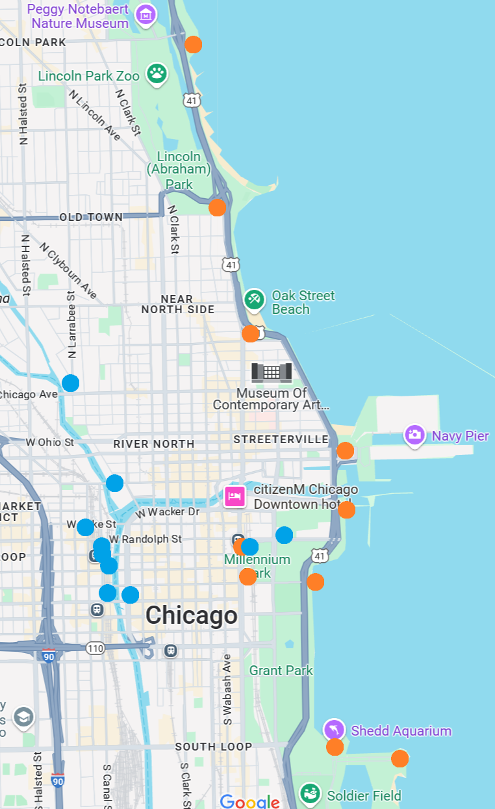
<figcaption aria-hidden="true">Map_of_starts</figcaption>
</figure>

``` r
sort(table(all_trips_v2$end_station_id), decreasing = TRUE)
```

    ## 
    ##   192    91    77   133    43   174    66   287    81   283    49    52    48 
    ## 15067 14865 13713  8991  8639  8581  6943  6519  6458  6409  6296  6244  6179 
    ##   211   110   176    35   195   638    47   212   199    71    59    36    56 
    ##  6108  5899  5514  5416  5408  5398  5316  5297  5272  5256  5203  5110  4846 
    ##    53    90    51    44    18   289    74    24   100   164    69   181    67 
    ##  4841  4588  4545  4527  4456  4378  4298  4295  4294  4283  4177  4075  4035 
    ##   210   423   191   344    38   107   198   300   255    50    26   140   142 
    ##  4008  3956  3950  3942  3911  3865  3848  3813  3793  3762  3712  3673  3657 
    ##    58    98    84   111    31   117    37   331   182   286    94    76    85 
    ##  3521  3513  3454  3430  3399  3332  3299  3295  3283  3277  3267  3259  3227 
    ##   134    39   196   241   125   161    13    75   240   112   321    41    21 
    ##  3166  3156  3156  3151  3123  3098  3049  3044  3042  2989  2982  2950  2863 
    ##   340   113   177   173   420   342   284   127   229   320   197    80   291 
    ##  2848  2805  2794  2762  2704  2698  2689  2648  2647  2592  2589  2570  2549 
    ##   426    20    33   322   141     3   194    96   304   115   301   118    73 
    ##  2532  2523  2509  2501  2495  2481  2468  2461  2451  2446  2379  2378  2343 
    ##    89   106   143   227   168   144   364   220   337   145   327    61    68 
    ##  2340  2328  2312  2307  2305  2299  2289  2282  2274  2247  2245  2227  2226 
    ##   359   156   621    54   232   128   172    40   303   264   273    72   313 
    ##  2225  2223  2214  2184  2179  2159  2154  2153  2140  2132  2131  2128  2118 
    ##   153   332   299   158   175    93    60   108   268   636   627   116   225 
    ##  2114  2102  2101  2096  2091  2049  2047  2025  2023  2017  2015  2002  1978 
    ##   635   230   233   414    99   130   296   114   186   109   260   254   349 
    ##  1946  1939  1926  1917  1916  1914  1868  1864  1858  1836  1826  1824  1821 
    ##    87    25   328   346   307   325   293    55   157   138     7   334   219 
    ##  1817  1790  1789  1770  1769  1766  1758  1755  1744  1740  1728  1716  1695 
    ##   324   123   620   217   312   129   624   317   463   338   345   231     5 
    ##  1663  1650  1633  1611  1605  1602  1594  1574  1574  1556  1539  1538  1525 
    ##    17   223   180   672    22    57   256   341    32   152   623   418    29 
    ##  1507  1503  1488  1487  1483  1465  1465  1463  1441  1439  1429  1418  1410 
    ##   131    92   288   242   247   374   165   190   188    88   329   657   226 
    ##  1401  1385  1368  1361  1361  1347  1341  1326  1325  1321  1300  1298  1293 
    ##   294   350   224   282   333    86    45     4   239   302   261   305   148 
    ##  1288  1281  1280  1279  1277  1253  1243  1242  1233  1228  1215  1208  1206 
    ##    46    16   126   626   146   376   183    14   248    19   343   417   119 
    ##  1203  1180  1175  1163  1161  1143  1142  1138  1133  1129  1111  1111  1106 
    ##   295     6   596   214    30   318   166   632   137   244    15   460   654 
    ##  1095  1089  1089  1086  1082  1082  1080  1066  1065  1056  1055  1047  1046 
    ##   383   257    28   243   277   394   637   326   459   622   154    23    97 
    ##  1016  1015  1011  1005  1003  1001   998   979   979   978   976   963   959 
    ##   205   258   285   213   432   454   306   458   461   160   298   245   425 
    ##   941   935   931   929   927   923   912   898   897   893   878   873   868 
    ##   290   159   234   163   604   169   347   511   237   464   506   419   253 
    ##   866   864   847   836   833   827   821   807   806   805   797   795   787 
    ##   339   238   249   507   319   222   250   308   309   120   310    27   121 
    ##   779   772   765   764   763   757   752   736   736   734   732   731   717 
    ##   447   451   659   597   292   251   605   482     2   323   673   236   276 
    ##   716   709   709   706   694   686   677   670   659   646   640   636   635 
    ##   515   314   639   170   493   275    62   658   315   272   505    42   259 
    ##   635   626   624   623   612   610   597   597   592   591   588   586   585 
    ##   523   491    34   462   150   457   465   207   478   202   520   184   162 
    ##   585   584   574   563   552   540   538   528   527   518   518   513   506 
    ##   502   185   215   499   149   504   103   208   628   297   311   330   178 
    ##   489   484   483   481   478   478   475   474   474   473   473   470   468 
    ##   246   503   625   370   486   147   475   206   316   660   656   228   641 
    ##   468   468   463   460   456   444   444   442   438   425   418   415   414 
    ##   274   406   501   489   481   124   365   216   603   498   171   402   490 
    ##   412   412   410   409   407   406   403   401   396   388   387   387   387 
    ##   218   453   664   601   267   280   483   644   655   136   381   424   472 
    ##   380   369   367   359   358   355   343   342   335   330   330   330   328 
    ##   209   252   449   467   122   413   132   366   471   509   403   135   203 
    ##   327   324   324   324   323   313   312   312   310   305   294   289   278 
    ##   474   437   278   484   479   497   204   477   354   348   382   663   442 
    ##   268   267   263   258   251   251   249   249   245   242   234   230   228 
    ##   279   598   476   492   500   480   487   416   405   510   631   666   377 
    ##   225   224   221   221   221   220   218   216   215   215   212   208   207 
    ##   434   496   179   263   335   452   470   401   517   527   522   525   448 
    ##   207   207   204   203   196   193   193   190   190   189   187   185   182 
    ##   640   351   378   281   373   101   508   488   450   485   643   336   552 
    ##   182   181   181   179   178   174   169   167   166   159   157   150   150 
    ##   469   602   456   645   494   193   262   592   375   591   466   271    12 
    ##   148   147   142   142   138   133   132   132   130   130   128   127   125 
    ##   468   518   514   367   619   355   590   369     9   410   385   265   422 
    ##   125   125   124   121   121   119   119   118   112   112   111   109   105 
    ##   368   599   662   600   589   661   415   353   427   495   526   408   439 
    ##   104   100    99    97    96    96    94    93    91    91    89    82    82 
    ##   532   547   411   446   356   412   551   167   519   428    11   201   559 
    ##    81    79    73    71    70    66    66    65    63    62    56    52    51 
    ##   594   429   270   431   200   102   430   630   535   444   388   407   390 
    ##    46    44    42    41    40    39    39    39    37    36    35    34    33 
    ##   409   436   352   455   550   558   445   573   586   671   399   392   435 
    ##    33    32    31    31    31    31    30    30    29    29    28    26    26 
    ##   421   443   595   524   544   553   563   438   534   571   585   546   570 
    ##    25    25    25    24    24    24    24    23    23    23    23    22    22 
    ##   575   360   528   433   572    95   548   581   441   576   396   555   561 
    ##    21    19    19    18    18    17    17    17    16    16    15    15    15 
    ##   398   531   542   549   566   653   533   539   587   440   545   567   391 
    ##    14    14    14    13    13    13    12    12    12    11    11    11    10 
    ##   574   642   649   578   580   650   395   554   583   670   400   529   565 
    ##    10    10    10     9     9     9     8     8     8     8     7     7     7 
    ##   577   582   646   386   540   543   556   537   569   588   541   560   536 
    ##     7     7     7     6     6     6     6     5     5     5     4     4     3 
    ##   538   557   579   647   361   384   393   530   593   665   562   564   648 
    ##     3     3     3     3     2     2     2     2     2     2     1     1     1

``` r
all_trips_v2 %>%
  group_by(member_casual, end_station_id) %>%
  summarise(Total_End_Instances = n()) %>%
  #slice_max(Total_End_Instances, n = 10) %>%
  ggplot(aes(x = end_station_id, y = Total_End_Instances, fill = member_casual)) +
  theme(axis.text.x = element_text(angle = 45)) +
  geom_col() + 
  labs(title = "Total of Each Station Being the End of a Ride")
```

    ## `summarise()` has grouped output by 'member_casual'. You can override using the
    ## `.groups` argument.

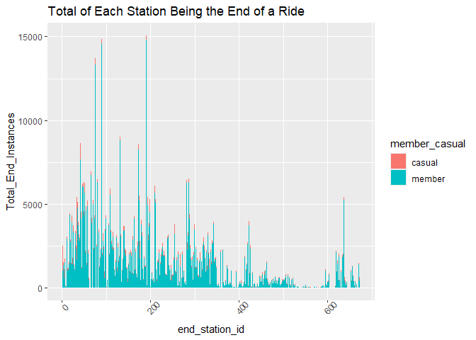<!-- -->

Top 10 most frequented end locations for members and casuals:

<figure>
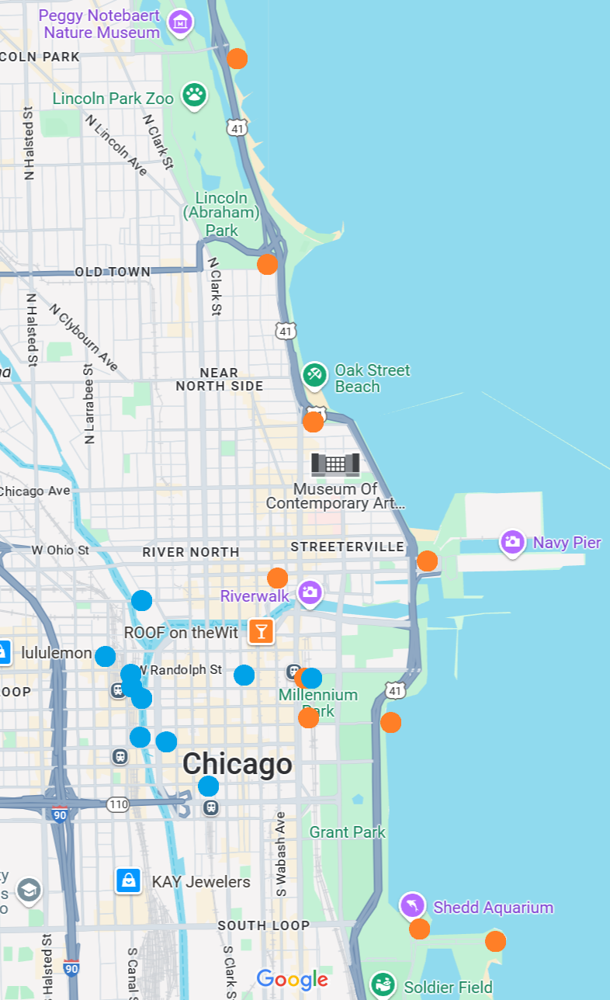
<figcaption aria-hidden="true">Map_of_starts</figcaption>
</figure>

``` r
all_trips_v2 %>%
  group_by(member_casual, start_station_id, time_of_day) %>%
  summarise(Total_Start_Instances = n()) %>%
  ##slice_max(total_starts, n = 10) %>%
  ggplot(aes(x = time_of_day, y = Total_Start_Instances, fill = member_casual)) +
  theme(axis.text.x = element_text(angle = 45)) +
  geom_col(position = "dodge") +
  labs(title = "Instances When a Ride Begins During the Day")
```

    ## `summarise()` has grouped output by 'member_casual', 'start_station_id'. You
    ## can override using the `.groups` argument.

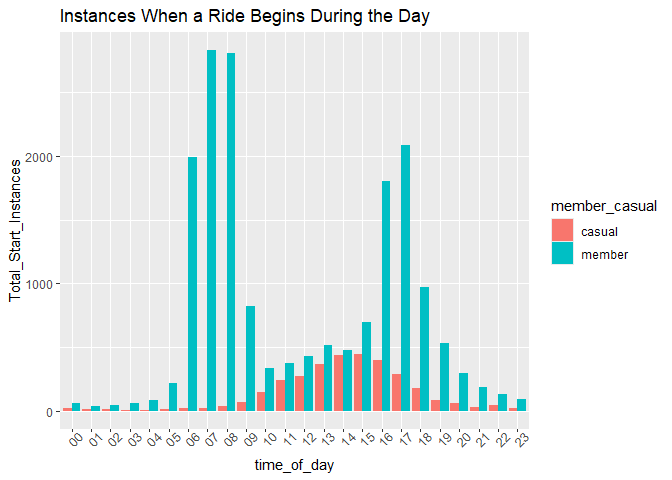<!-- -->

``` r
all_trips_v2 %>%
  group_by(member_casual, end_station_id, time_of_day) %>%
  summarise(Total_End_Instances = n()) %>%
  ##slice_max(total_starts, n = 10) %>%
  ggplot(aes(x = time_of_day, y = Total_End_Instances, fill = member_casual)) +
  theme(axis.text.x = element_text(angle = 45)) +
  geom_col(position = "dodge") + 
  labs(title = "Instances When a Ride Ends During the Day")
```

    ## `summarise()` has grouped output by 'member_casual', 'end_station_id'. You can
    ## override using the `.groups` argument.

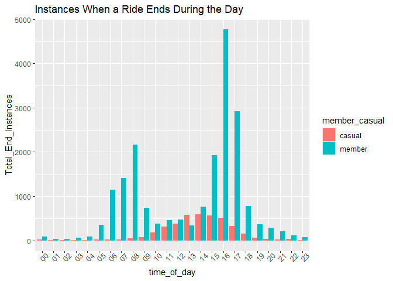<!-- -->

For members, a few thousand rides begin at 7-8 a.m. or 4-5 p.m. and end
within the same hour. But for casuals, there is a single trend of their
rides begining and ending between 10 a.m. - 5 p.m. with a peak at
1-2p.m.

Once I analyzed the start and end stations individually, I then looked
at the number one most repeated start AND end station pair for members
and casuals by each day of the week and found that the most frequented
station for casuals is used every single day of the week, while the
members use the same start and end stations for multiple days of the
week.

``` r
all_trips_v2$stationid_pairs <- paste(all_trips_v2$start_station_id, ",", all_trips_v2$end_station_id)
all_trips_v2$stationname_pairs <- paste(all_trips_v2$start_station_name, ",", all_trips_v2$end_station_name)


all_trips_v2 %>%
  group_by(member_casual, day_of_week, stationname_pairs) %>%
  summarise(Start_and_End_Total = n()) %>%
  slice_max(Start_and_End_Total, n = 1)
```

    ## `summarise()` has grouped output by 'member_casual', 'day_of_week'. You can
    ## override using the `.groups` argument.

    ## # A tibble: 14 × 4
    ## # Groups:   member_casual, day_of_week [14]
    ##    member_casual day_of_week stationname_pairs               Start_and_End_Total
    ##    <chr>         <ord>       <chr>                                         <int>
    ##  1 casual        Sunday      Lake Shore Dr & Monroe St , La…                 202
    ##  2 casual        Monday      Lake Shore Dr & Monroe St , La…                  54
    ##  3 casual        Tuesday     Lake Shore Dr & Monroe St , St…                  67
    ##  4 casual        Wednesday   Lake Shore Dr & Monroe St , La…                  72
    ##  5 casual        Thursday    Lake Shore Dr & Monroe St , St…                  71
    ##  6 casual        Friday      Lake Shore Dr & Monroe St , La…                  98
    ##  7 casual        Saturday    Lake Shore Dr & Monroe St , St…                 179
    ##  8 member        Sunday      University Ave & 57th St , Ell…                  97
    ##  9 member        Monday      Canal St & Adams St , Michigan…                 173
    ## 10 member        Tuesday     Michigan Ave & Washington St ,…                 205
    ## 11 member        Wednesday   Michigan Ave & Washington St ,…                 204
    ## 12 member        Thursday    Michigan Ave & Washington St ,…                 231
    ## 13 member        Friday      Canal St & Adams St , Michigan…                 171
    ## 14 member        Saturday    Ellis Ave & 60th St , Ellis Av…                  83

``` r
all_trips_v2 %>%
  group_by(member_casual, day_of_week, stationname_pairs) %>%
  summarise(Start_and_End = n()) %>%
  slice_max(Start_and_End, n = 1) %>%
  ##print(n = 28) %>%
  ggplot(aes(x = day_of_week, y = Start_and_End, fill = stationname_pairs)) +
  facet_wrap(~member_casual) +
  theme(axis.text.x = element_text(angle = 45)) +
  geom_col(position = "dodge") +
  labs(title = "Most Frequented Start and End Stations During the Week")+
  theme(legend.position="bottom")
```

    ## `summarise()` has grouped output by 'member_casual', 'day_of_week'. You can
    ## override using the `.groups` argument.

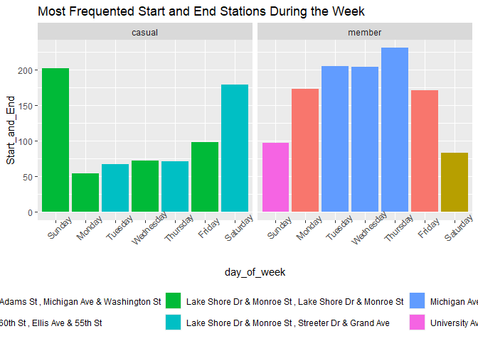<!-- -->

## TOP 3 DIFFERENCES IN BEHAVIOR

The top 3 differences in behavior between members and casuals that I
have identified are:

1.  Members use Cyclistic bikes far more often, while casuals use
    Cyclistic bikes for far longer.

2.  Members use Cyclistic to get to and from work, while casuals use
    Cyclistic for recreational purposes.

3.  While each group of Cyclistic user favors the same few stations,
    members frequent stations within the city, while casuals frequent
    stations on the coastline in tourist areas.
